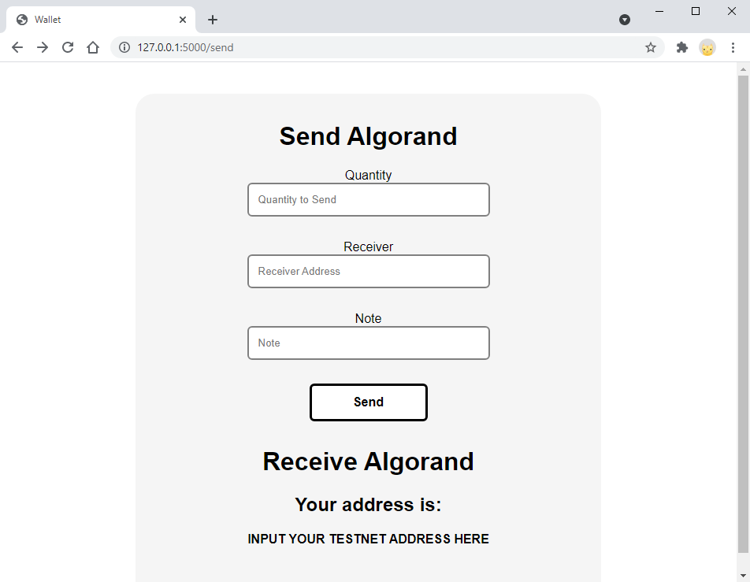
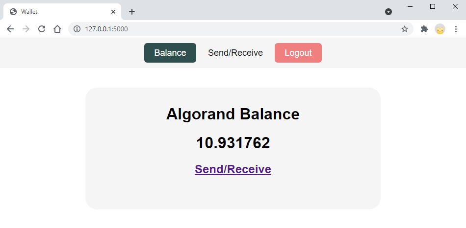
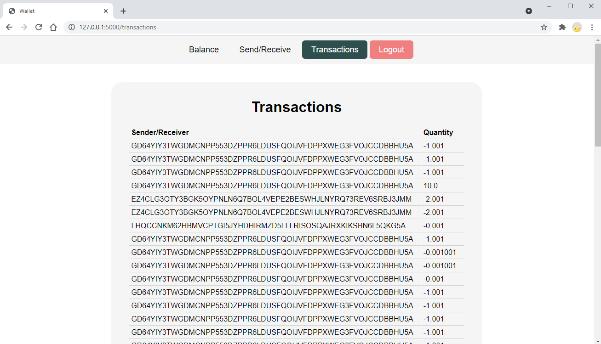
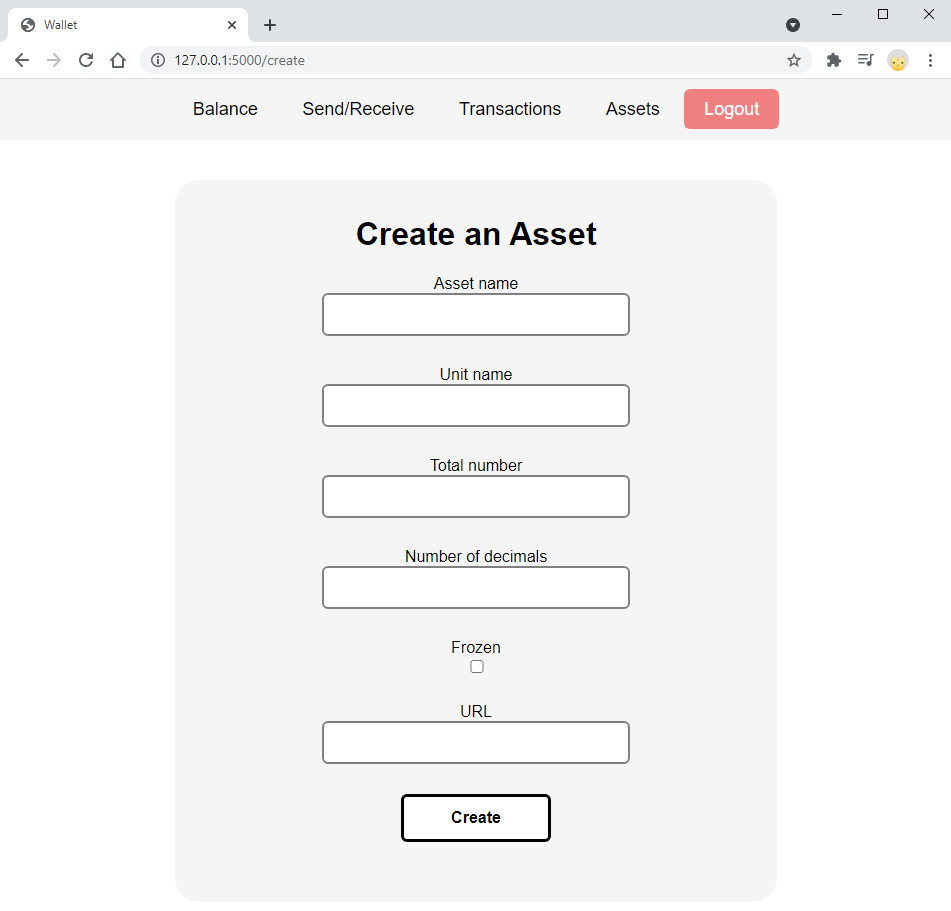
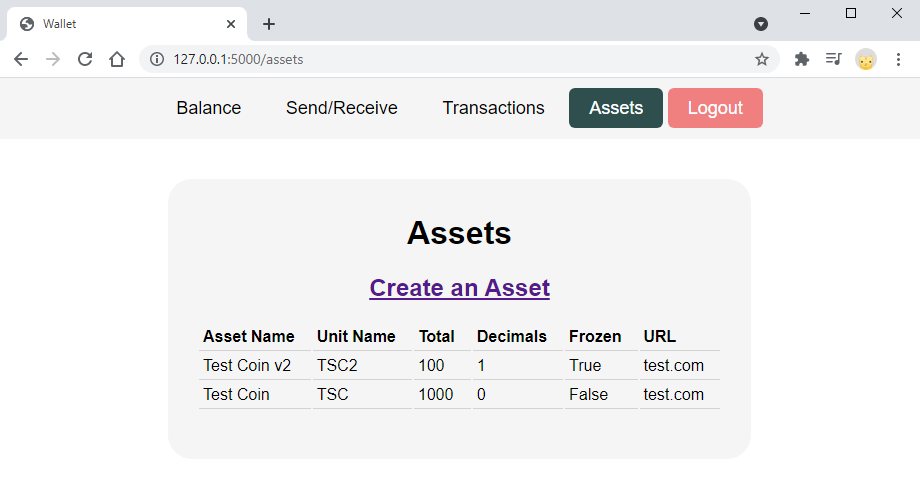
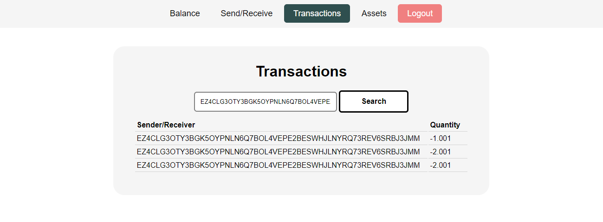
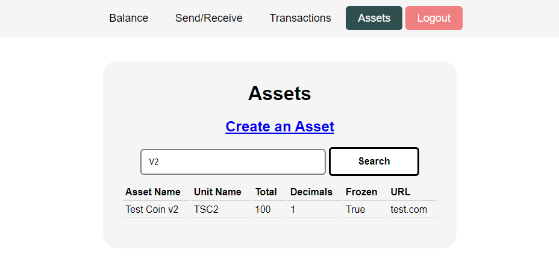

# Creating a demo wallet using Flask

In this project we'll go through the steps of putting together a basic Algorand wallet website using Flask.

This wallet will feature:
- Sending transactions
- Logging in with a 25-word mnemonic
- Creating an account
- Viewing all sent/received transactions
- Creating and displaying assets

As a warning, this project has been not audited and should not be used in a production environment.

If you would like to see the final project, or if you're unsure about the file structure, you can check out the [GitHub repository](https://github.com/michaelockenden/algorand-flask).


# Introduction and Setup

Flask is most well known for being able to quickly put together websites, however it is capable of more sturdy features.
We'll achieve this by also using Flask-WTF and Flask-Login.

Along with the Python Algorand SDK, our requirements file should look like this:

```text
flask
flask-login
flask-wtf
py-algorand-sdk
```

I also highly recommend using `python-dotenv` to store sensitive information and avoid committing them to a public repository. Flask also has inbuilt functionality with `python-dotenv`, allowing Flask environment variables to be automatically stored in any `.env` file. However, in this solution I'll put the values in the code, which you can replace.

In order to access the algorand network, you need to be running a node. You can do this yourself, but it might be easier to grab an API key from a third party, such as at https://developer.purestake.io/login.

You will need to use a virtual environment to correctly use Flask. This can be done as follows (these commands use Windows):

- Create a directory for your project
- Inside your project directory, type in `py -m venv venv`
- Activate your virtual environment with `.\venv\Scripts\activate`

# Creating the initial Flask application

To begin, first create a file structure as shown:
```bash
└── your_project_name/
    ├── venv/
    ├── your_application_name/
    │    ├── __init__.py
    │    └── views.py
    └── requirements.txt
    └── wsgi.py
```

`requirements.txt` should be filled with the requirements mentioned earlier. We can install this with `pip install -r requirements.txt`. Make sure your virtual environment is activated.

The remaining files should be filled out as such:

`__init__.py`:
```python
from flask import Flask

from . import views

def create_app():
    app = Flask(__name__)
    app.config["SECRET_KEY"] = "put any long random string here"
    app.register_blueprint(views.main_bp)
    return app
```

`views.py`:
```python
from flask import Blueprint

main_bp = Blueprint(
    'main_bp', __name__,
    template_folder='templates',
    static_folder='static'
)

@main_bp.route('/')
def index():
    return "Algorand Balance"
```

`wsgi.py`:
```python
from your_application_name import create_app

app = create_app()

if __name__ == "__main__":
    app.run(host='0.0.0.0')
```

This can be run with `flask run`. It is important to note that `flask run` will by default look for a file called `wsgi.py` so don't rename it.

If you haven't used Flask before, this may seem initimidating, and if you have used Flask, you probably know that the same outcome can be acheived with a single `app.py`, written as:

```python
from flask import Flask

app = Flask(__name__)

@app.route('/')
def index():
    return "Algorand Balance"
```

The reason we've structured it like this is for a lot more flexibility. As we start adding more features, a single `app.py` will quickly become overcrowded and hard to use. What we've done is used a Flask Blueprint to separate components.

Now you might be wondering about the static and template folders mentioned in `views.py`. These are to store the project's CSS and HTML, respectively. We can add these folders as so:

```bash
└── your_project_name/
    ├── venv/
    ├── your_application_name/
    │   ├── static/
    │   │   └── css/
    │   ├── templates/
    │   ├── __init__.py
    │   └── views.py
    ├── requirements.txt
    └── wsgi.py
```

Now create `style.css` inside `css` and `layout.html` inside `templates`.

`style.css`
```css
body {
    margin: 0;
    font-family: helvetica;
    color: black;
}

.container {
    display: flex;
    justify-content: center;
}
.content {
    text-align: center;
    padding: 15px;
    margin: 40px;
    border-radius: 24px;
    background-color: whitesmoke;
    width: 60%;
    position: absolute;
    padding-bottom: 48px;
}
```

`layout.html`
```html
<!doctype html>
<html lang="en">
<head>
    <meta charset="utf-8">
    <link href="{{ url_for('static', filename='css/style.css') }}" rel="stylesheet">
    <title>Wallet</title>
</head>
<body>
<div class="container">
    <div class="content">
         
    </div>
</div>
</body>
</html>
```

Flask contains Jinja2, which we can use to add logic to HTML using the curly braces. We can create the `index.html` file which extends from this layout.

`index.html`
```html



<h1>Algorand Balance</h1>

```

How this works is that by extending from `layout.html`, the blocks in `index.html` replace the blocks in `layout.html`.

Now in order to display the new index page, we need to render it with Flask.
Replace `views.py` with:

```python
from flask import Blueprint, render_template

main_bp = Blueprint(
    'main_bp', __name__,
    template_folder='templates',
    static_folder='static'
)

@main_bp.route('/')
def index():
    return render_template('index.html')
```

Running `flask run` again should now give a page looking like this:


# Interacting with the Algod Client

Now we should start thinking about getting account information. To do this, we can use the algod client.

Create a new file called `algod.py` inside the `your_application_name` directory.

```python
from algosdk import account, mnemonic
from algosdk.constants import microalgos_to_algos_ratio
from algosdk.v2client import algod

def algod_client():
    algod_address = "https://testnet-algorand.api.purestake.io/ps2"
    algod_token = "YOUR API KEY GOES HERE"
    headers = {
        "X-API-Key": algod_token,
    }

    return algod.AlgodClient(algod_token, algod_address, headers)

def create_account():
    private_key, address = account.generate_account()
    return mnemonic.from_private_key(private_key)

def get_balance(address):
    account_info = algod_client().account_info(address)
    balance = account_info.get('amount') / microalgos_to_algos_ratio

    return balance
```

This method uses Purestake.io to connect to the algod client. After putting in your API key, 
run `passphrase = create_account()` to generate a TestNet account and save the passphrase. Make sure you store this somewhere because we'll be using it a lot before implementing a login system.

Note that we made a helper function to return the algod client whenever. From now on, we'll be calling this function to use the client, so be sure to use `algod_client()` and not `algod_client`.

Now we can get the balance of our new account by running `balance = get_balance(mnemonic.to_public_key(passphrase))`. 
We need to convert the account passphrase into its public key - the address - in order to check the balance.

Note that by default, balance is stored in microAlgos, which is equivalent to 0.000001 Algos, the unit a wallet would normally display.

You can add more algorand to your account on the TestNet using the [Algorand Dispenser](https://bank.testnet.algorand.network/). 

Let's now bring this value onto our Flask app.

Add the following to `views.py`:

```python
...
from .algod import get_balance
...

def index():
    balance = get_balance("INPUT YOUR TESTNET ADDRESS HERE")
    return render_template('index.html', balance=balance)
```

`index.html`:

```python



<h1>Algorand Balance</h1>
<h1>{{ balance }}</h1>

```

Now using `flask run` will display the user's balance


# Sending transactions with the Algod Client

Now that we have a working account balance, the next step should be to implement a way to send some algorands back.
Here we'll also be working with `Flask-WTF` to create forms for these transactions.

We can start by creating a new file `forms.py` inside of `your_application_name`:

```python
from algosdk.constants import address_len, note_max_length
from flask_wtf import FlaskForm
from wtforms import DecimalField, StringField, SubmitField
from wtforms.validators import InputRequired, Optional, Length, NumberRange

class SendForm(FlaskForm):
    """Form for creating a transaction"""
    quantity = DecimalField(
        'Quantity',
        validators=[InputRequired(), NumberRange(min=0)],
        render_kw={"placeholder": "Quantity to Send"}
    )
    receiver = StringField(
        'Receiver',
        validators=[InputRequired(), Length(min=address_len, max=address_len)],
        render_kw={"placeholder": "Receiver Address"}
    )
    note = StringField(
        'Note',
        validators=[Optional(), Length(max=note_max_length)],
        render_kw={"placeholder": "Note"})
    submit = SubmitField('Send')
```

This provides some of the parameters necessary for sending a transaction. WTForms, which is included with Flask-WTF, provides several validators to make our lives easier.
This means we can prevent errors when know will fail before calling the algod client.
`algosdk.constants` gives us the values we need to validate our form.

Under `views.py`, we can add a new route:

```python
from .forms import SendForm

@main_bp.route('/send', methods=['GET', 'POST'])
def send():
    """Provides a form to create and send a transaction"""
    form = SendForm()
    address = "INPUT YOUR TESTNET ADDRESS HERE" # use mnemonic.to_public_key(passphrase)
    sk = "INPUT YOUR PRIVATE KEY HERE" # use mnemonic.to_private_key(passphrase)
    if form.validate_on_submit():
        success = send_txn(address, form.quantity.data, form.receiver.data, form.note.data, sk)
        return render_template('success.html', success=success)

    # show the form, it wasn't submitted
    return render_template('send.html', form=form, address=address)
```

We can add two new HTML files now. Both make use of our previous `layout.html`.

`send.html`

```html



<h1>Send Algorand</h1>
<form action="{{ url_for('main_bp.send') }}" method="post">
    {{ form.csrf_token }}

    {{ form.quantity.label }}
    <br>
    {{ form.quantity }}
    <br>
    
        <h3>{{ form.quantity.errors[0] }}</h3>
    
    <br>
    {{ form.receiver.label }}
    <br>
    {{ form.receiver }}
    <br>
    
        <h3>{{ form.receiver.errors[0] }}</h3>
    
    <br>
    {{ form.note.label }}
    <br>
    {{ form.note }}
    <br>
    
        <h3>{{ form.note.errors[0] }}</h3>
    
    <br>
    {{ form.submit }}
</form>
<h1>Receive Algorand</h1>
<h2>Your address is:</h2>
<h4>{{ address }}</h4>

```

`success.html`

```html




<h1>Transaction Success</h1>

<h1>Transaction Failed</h1>


```

Here is the CSS I like to use for forms:

```css
input {
    width: 280px;
    padding: 12px;
    margin-bottom: 12px;
    border-radius: 6px;
    border: 2px solid grey;
    box-sizing: content-box;
}

input[type=submit] {
    font-size: 16px;
    font-weight: bold;
    border: 3px solid black;
    border-radius: 6px;
    width: 120px;
    background-color: white;
    color: black;
}

input[type=submit]:hover {
    background-color: darkslategrey;
    color: white;
    cursor: pointer;
}
```

Now if you do `flask run` and add `/send` to the address bar, your page should look like this:



You can also add a link from your index with `<h2><a href="{{ url_for('main_bp.send') }}">Send/Receive</a></h2>`

Notice if you try to click submit you would just get an error. We still need to implement actually sending the algorand using the algod client.

We can add to `algod.py`

```python
from algosdk.future.transaction import PaymentTxn

...

def send_transaction(sender, quantity, receiver, note, sk):
    """Create and sign a transaction. Quantity is assumed to be in algorands, not microalgos"""

    quantity = int(quantity * microalgos_to_algos_ratio)
    params = algod_client().suggested_params()
    note = note.encode()
    try:
        unsigned_txn = PaymentTxn(sender, params, receiver, quantity, None, note)
    except Exception as err:
        print(err)
        return False
    signed_txn = unsigned_txn.sign(sk)
    try:
        txid = algod_client().send_transaction(signed_txn)
    except Exception as err:
        print(err)
        return False

    # wait for confirmation
    try:
        wait_for_confirmation(txid, 4)
        return True
    except Exception as err:
        print(err)
        return False


# utility for waiting on a transaction confirmation
def wait_for_confirmation(transaction_id, timeout):
    """
    Wait until the transaction is confirmed or rejected, or until 'timeout'
    number of rounds have passed.
    Args:
        transaction_id (str): the transaction to wait for
        timeout (int): maximum number of rounds to wait
    Returns:
        dict: pending transaction information, or throws an error if the transaction
            is not confirmed or rejected in the next timeout rounds
    """

    start_round = algod_client().status()["last-round"] + 1
    current_round = start_round

    while current_round < start_round + timeout:
        try:
            pending_txn = algod_client().pending_transaction_info(transaction_id)
        except Exception as err:
            print(err)
            return
        if pending_txn.get("confirmed-round", 0) > 0:
            return pending_txn
        elif pending_txn["pool-error"]:
            raise Exception(
                'pool error: {}'.format(pending_txn["pool-error"]))
        algod_client().status_after_block(current_round)
        current_round += 1
    raise Exception(
        'pending tx not found in timeout rounds, timeout value = : {}'.format(timeout))
```

Now add `from .algod import send_txn` to `views.py`.

You can now test out sending algorand back to the dispenser with the address GD64YIY3TWGDMCNPP553DZPPR6LDUSFQOIJVFDPPXWEG3FVOJCCDBBHU5A.
Make sure you have enough funds, or the transaction will fail.

# Implementing a Login System with Flask-Login

Before we get too far, we need to structure our code to allow some kind of Login System. Flask-Login can handle the finer details, and we can start by first creating a User class.

Create a new file `models.py` inside of `your_application_name`:

```python
from algosdk import mnemonic
from flask_login import UserMixin

from .algod import get_balance, send_txn

class User(UserMixin):
    """User account model"""

    def __init__(self, passphrase):
        """Creates a user using the 25-word mnemonic"""
        self.passphrase = passphrase

    @property
    def id(self):
        """Returns private key from mnemonic"""
        return mnemonic.to_private_key(self.passphrase)

    @property
    def public_key(self):
        """Returns public key from mnemonic. This is the same as the user's address"""
        return mnemonic.to_public_key(self.passphrase)

    def get_balance(self):
        """Returns user balance, in algos"""
        return get_balance(self.public_key)

    def send(self, quantity, receiver, note):
        """Returns True for a succesful transaction. Quantity is given in algos"""
        return send_txn(self.public_key, quantity, receiver, note, self.id)

```

Normally, when creating a User class, we would also use a database to store account details.
However, this isn't as important when working with blockchain technology.

After inputting a passphrase, we can find the user's public key (address) and private key. We called the private key the user ID so that it will work with some Flask-Login features later. 

Notice the functions `get_balance` and `send`, we'll soon be calling these from `views.py` so we no longer need to pass in our address every time.

Next let's quickly create the form will be using to sign in.

```forms.py```
```python
class LoginForm(FlaskForm):
    """Form for logging into an account"""
    passphrase = StringField('25-word Passphrase', validators=[InputRequired()])
    submit = SubmitField('Login')
```

Along with the corresponding HTML.

```login.html```
```html



<h1>Login</h1>
<form action="{{ url_for('auth_bp.login') }}" method="post">
    {{ form.csrf_token }}

    {{ form.passphrase.label }}
    <br>
    {{ form.passphrase }}
    <br><br>
    {{ form.submit }}
</form>


<h2>Passphrase not found</h2>

<br><br><br>


<br>
<h2><a href="{{ url_for('auth_bp.signup') }}">Create a Wallet</a></h2>

```

Now we can create a new file called `auth.py`. This file will function similarly to `views.py` but it will only handle routes related to user authentication.

```python
from algosdk import mnemonic
from flask import Blueprint, render_template, redirect, url_for, flash
from flask_login import LoginManager, current_user, login_user

from .algod import create_account
from .forms import LoginForm
from .models import User

login_manager = LoginManager()

auth_bp = Blueprint(
    'auth_bp', __name__,
    template_folder='templates',
    static_folder='static'
)


@auth_bp.route('/login', methods=['GET', 'POST'])
def login():
    """Default login page"""
    if current_user.is_authenticated:
        return redirect(url_for('main_bp.index'))

    form = LoginForm()
    if form.validate_on_submit():
        try:
            user = User(passphrase=form.passphrase.data)
            login_user(user)
            return redirect(url_for('main_bp.index'))
        except Exception as err:
            flash(err)
            return render_template('login.html', form=form)
    return render_template('login.html', form=form)
```

We are now using a new Flask Blueprint, `auth_bp`. This will need to be added to `__init__.py`.

```python
from flask import Flask

from . import auth
from . import views


def create_app():
    app = Flask(__name__)
    app.config["SECRET_KEY"] = "put any long random string here"

    auth.login_manager.init_app(app)

    app.register_blueprint(views.main_bp)
    app.register_blueprint(auth.auth_bp)

    return app
```

The secret key is used to encrypt browser cookies, making it especially important for storing user information.

Now, we can use Flask-Login to set routes as `login_required`, meaning they can't be accessed without an account. 
Also, the `current_user` instance is used to retrieve information about the signed-in user. Let's now add these into our `views.py`.

```python
from flask_login import login_required, current_user

...

@main_bp.route('/')
@login_required
def index():
    """Main page, displays balance"""
    balance = current_user.get_balance()
    return render_template('index.html', balance=balance)


@main_bp.route('/send', methods=['GET', 'POST'])
@login_required
def send():
    """Provides a form to create and send a transaction"""
    form = SendForm()
    address = current_user.public_key
    if form.validate_on_submit():
        success = current_user.send(form.quantity.data, form.receiver.data, form.note.data)
        return render_template('success.html', success=success)

    # show the form, it wasn't submitted
    return render_template('send.html', form=form, address=address)
```

Before any of this code can run, we need to add two functions to `auth.py`.

```python
@login_manager.user_loader
def load_user(user_id):
    """User load logic"""
    return User(mnemonic.from_private_key(user_id))


@login_manager.unauthorized_handler
def unauthorized():
    """Redirect unauthorized users to login page"""
    return redirect(url_for('auth_bp.login'))
```

`load_user` gathers a user from a given ID. We named the private key our User ID, so here we get a User from a given private key.


`unauthorized` redirects you to the login page if you haven't signed in.

Now finally, try running the code. You should see a login page - put in your passphrase to sign in.


## Navigation Bar

Now that we can sign in, we should provide an easy way to sign out. Here I provide the CSS and HTML I used for a navigation bar.

`nav.html`

```python
<nav class="topnav">
    <a href="{{ url_for('main_bp.index') }}"  class="active">Balance</a>
    <a href="{{ url_for('main_bp.send') }}"  class="active">Send/Receive</a>
    
    <a class="logout" href="{{ url_for('main_bp.logout') }}"> Logout </a>
    
</nav>
```

```css
.topnav {
    background-color: whitesmoke;
    padding: 20px;
    text-align: center;
}

/* Style the links inside the navigation bar */
.topnav a {
    color: black;
    padding: 10px;
    padding-left: 20px;
    padding-right: 20px;
    text-decoration: none;
    border-radius: 6px;
    font-size: 18px;
}

/* Change the color of links on hover */
.topnav a:hover {
    background-color: lightgrey;
    color: black;
}

/* Add a color to the active/current link */
.topnav a.active {
    background-color: darkslategrey;
    color: white;
}

.topnav a.logout {
    background-color: lightcoral;
    color: white;
}
```

You will need to include the nav bar in `layout.html`. 
This can be done by ``.

The logout route also should be defined in `views.py`. 
This route uses `redirect()` to go back to the login page.

```python
from flask import redirect, url_for
from flask_login import logout_user

@main_bp.route('/logout')
@login_required
def logout():
    """User log-out logic."""
    logout_user()
    return redirect(url_for('auth_bp.login'))
```



We can now remove our send/receive link from the index.

## Account Creation

We can also add a sign-up button, and generate an account in the website. In `auth.py`, add the following:

```python
@auth_bp.route('/signup', methods=['GET', 'POST'])
def signup():
    """Generates a user account and shows its passphrase"""
    passphrase = create_account()
    user = User(passphrase=passphrase)
    login_user(user)
    return render_template('mnemonic.html', passphrase=passphrase)
```

Here we use our earlier function from `algod.py` to generate an account and its passphrase.
Add this link `<h2><a href="{{ url_for('auth_bp.signup') }}">Create a Wallet</a></h2>` to `login.html` to access this route.

However, we also need to create `mnemonic.html` this page will display the mnemonic of the created account.

```html



<h1>Your Account Recovery Phrase:</h1>
<br>
<h2>{{ passphrase }}</h2>
<h2>Note this down and keep it secret!</h2>

```

I also added a route to this mnemonic in `views.py`. 
This route uses the current account instead of creating a new one.

```python
@main_bp.route('/mnemonic')
@login_required
def mnemonic():
    """Displays the recovery passphrase"""
    passphrase = current_user.passphrase
    return render_template('mnemonic.html', passphrase=passphrase)
```

This can be accessed with `<h2><a href="{{ url_for('main_bp.mnemonic') }}">View Recovery Passphrase</a></h2>` on `index.html`

We've now finished our login system for the website. 
You can log in using a passphrase or create an account, and then you can then log out when finished.


# Displaying Transactions using the Indexer

The indexer is used to retrieve all transactions on the blockchain.
We can then filter this to all transactions related to the current account.

Let's start by creating a new file `indexer.py`, here we will put all indexer processes.

`indexer.py`
```python
from algosdk.constants import microalgos_to_algos_ratio
from algosdk.v2client import indexer

def myindexer():
    algod_address = "https://testnet-algorand.api.purestake.io/idx2"
    algod_token = "YOUR API KEY GOES HERE"
    headers = {
        "X-API-Key": algod_token,
    }
    return indexer.IndexerClient("", algod_address, headers)

def get_transactions(address):
    """Returns a list of transactions related to the given address"""

    response = myindexer().search_transactions(address=address)
    txns = []
    for txn in response["transactions"]:
        try:
            sender = txn["sender"]
            fee = txn["fee"]
            txn = txn["payment-transaction"]
            amount = txn["amount"]
            if sender == address:
                # if the current account is the sender, add fee and display transaction as negative
                amount += fee
                amount *= -1
                other_address = txn["receiver"]
            else:
                other_address = sender
            amount /= microalgos_to_algos_ratio
            txns.append({"amount": amount, "address": other_address})
        except KeyError:
            continue
    return txns
```

`myindexer()` is a helper function just like `algod_client()`. 

`get_transactions` works by looping through each transaction related to the address.
It works to create a new list we want display on our website.
If the given address is also the sender, we want to also add the fee the sender paid
and display the total cost as negative. 

We return a list of dictionaries that includes an `"amount"` and an `"address"`. 
`"amount"` will show the money entering/leaving the user's account and `"address"`
will show the other address the transaction was completed with.

Now, as usual, we can add a route in `views.py` to call this function.

```python
@main_bp.route('/transactions')
@login_required
def transactions():
    """Displays all transactions from the user"""
    txns = current_user.get_transactions()
    return render_template('transactions.html', txns=txns)
```

`transactions.html` should look like this:

```html



<h1>Transactions</h1>
<table>
    <tr>
        <th>Sender/Receiver</th>
        <th>Quantity</th>
    </tr>
    
    <tr>
        <td>{{ txn.address }}</td>
        <td>{{ txn.amount }}</td>
        </div>
    </tr>
    
</table>

```

With the following CSS:
```css
table {
    text-align: left;
    margin-left: auto;
    margin-right: auto;
}

th, td {
    border-bottom: 1px solid lightgrey;
    padding: 4px;
    padding-right: 16px;
}
```

Don't forget to add `transaction.html` to the navbar!

If you tried running now you would still get error - we need to add `get_transactions` to the user model
so that we can add the user's address.

`models.py`

```python
from .indexer import get_transactions

class User(UserMixin):
    
    ...
    
    def get_transactions(self):
        """Returns a list of the user's transactions"""
        return get_transactions(self.public_key)
```

Now we can run, and view all transactions.



If you want to, you could also try displaying negative transactions as red, and positive transactions as green.


# Working with Assets

Assets can be used for a variety of purposes within the Algorand network.
We're only going to look at creating assets and displaying the created assets.

For more information on assets and what you can do with them, I recommend
reading about them on the [Developer Portal](https://developer.algorand.org/docs/features/asa/).

## Asset Creation Form

In order to create assets, we'll first need a new form class.

`forms.py`

```python
from algosdk.constants import max_asset_decimals
from flask_wtf import FlaskForm
from wtforms import StringField, SubmitField, IntegerField, BooleanField
from wtforms.validators import InputRequired, Optional, NumberRange

class AssetForm(FlaskForm):
    """Form for creating an asset"""
    asset_name = StringField(
        'Asset name',
        validators=[InputRequired()]
    )
    unit_name = StringField(
        'Unit name',
        validators=[InputRequired()]
    )
    total = IntegerField(
        'Total number',
        validators=[InputRequired(), NumberRange(min=1)]
    )
    decimals = IntegerField(
        'Number of decimals',
        validators=[InputRequired(), NumberRange(min=0, max=max_asset_decimals)]
    )
    default_frozen = BooleanField(
        'Frozen',
        validators=[Optional()]
    )
    url = StringField(
        'URL',
        validators=[Optional()]
    )
    submit = SubmitField('Create')
```

The is one more necessary parameter for creating an asset - the creator address.
We will automatically put the current user's address as the creator.

There are also four other addresses an asset can use:
- Manager address
- Freeze address
- Reserve address
- Clawback address

These addresses are granted special permissions related to the asset. 
For simplicity's sake, we'll set also set these addresses to the current user's address.

Now create an `assets.html` pages in `templates`

```html



<h1>Assets</h1>
<a href="{{ url_for('main_bp.create') }}"><h2>Create an Asset</h2></a>

```

We'll later display our created assets here. 

Now let's add the same routes into `views.py`.

```python
from .forms import AssetForm

@main_bp.route('/assets')
@login_required
def assets():
    return render_template('assets.html')

@main_bp.route('/create', methods=['GET', 'POST'])
@login_required
def create():
    """Provides a form to create an asset"""
    form = AssetForm()
    if form.validate_on_submit():
        asset_id = current_user.create(
            form.asset_name.data,
            form.unit_name.data,
            form.total.data,
            form.decimals.data,
            form.default_frozen.data,
            form.url.data
        )

        return redirect(url_for('main_bp.assets'))

    # show the form, it wasn't submitted
    return render_template('create_asset.html', form=form)
```

We'll need to create the HTML page for the form now.

```html



<h1>Create an Asset</h1>
<form action="{{ url_for('main_bp.create') }}" method="post">
    {{ form.csrf_token }}

    {{ form.asset_name.label }}
    <br>
    {{ form.asset_name }}
    <br><br>
    {{ form.unit_name.label }}
    <br>
    {{ form.unit_name }}
    <br><br>
    {{ form.total.label }}
    <br>
    {{ form.total }}
    <br><br>
    {{ form.decimals.label }}
    <br>
    {{ form.decimals }}
    <br><br>
    {{ form.default_frozen.label }}
    <br>
    {{ form.default_frozen }}
    <br><br>
    {{ form.url.label }}
    <br>
    {{ form.url }}
    <br><br>
    {{ form.submit }}
    <br>
    
        <h2>Invalid submission</h2>
    
</form>

```

After adding Assets to the navbar, we should be able to get a form looking like this:



Of course, this won't work until we implement the backend of creating an asset.

## Creating Assets with the Algod Client

Under `models.py`, we can create a new method. 
This method will add the current user's public and private keys to the parameters needed to create an asset.

```python
from .algod import create_asset

class User(UserMixin):
    
    ...

    def create(
            self,
            asset_name,
            unit_name,
            total,
            decimals,
            default_frozen,
            url
    ):
        """Creates an asset, with the user as the creator"""
        return create_asset(
            self.public_key,
            asset_name,
            unit_name,
            total,
            decimals,
            default_frozen,
            url,
            self.id
        )    
```

Now we can implement the `create_asset` function in `algod.py`.

```python
from algosdk.future.transaction import AssetConfigTxn

def create_asset(
        creator,
        asset_name,
        unit_name,
        total,
        decimals,
        default_frozen,
        url,
        sk
):
    """Creates an asset, returns the newly created asset ID"""
    params = algod_client().suggested_params()

    txn = AssetConfigTxn(
        sender=creator,
        sp=params,
        total=total,
        default_frozen=default_frozen,
        unit_name=unit_name,
        asset_name=asset_name,
        manager=creator,
        reserve=creator,
        freeze=creator,
        clawback=creator,
        url=url,
        decimals=decimals)

    # Sign with secret key of creator
    stxn = txn.sign(sk)

    # Send the transaction to the network and retrieve the txid.
    txid = algod_client().send_transaction(stxn)

    try:
        wait_for_confirmation(txid, 4)
    except Exception as err:
        print(err)
        return None

    try:
        ptx = algod_client().pending_transaction_info(txid)
        asset_id = ptx["asset-index"]
        return asset_id
    except Exception as err:
        print(err)
        return None    
```

You can now test out creating an asset, but you won't see any feedback.
Next we will display all the created assets under the Asset page.

## Displaying Created Assets

Creating an assets creates a special transaction for the user,
and so just like before, we will use the indexer to find and display these transactions.

As always, we use our User model to input the current user address.

`models.py`

```python
from .indexer import get_assets

class User(UserMixin):
    
    ...
    
    def get_assets(self):
        """Returns a list of the user's assets"""
        return get_assets(self.public_key)
```

Now we can use the indexer to find all created assets from the given address

`indexer.py`

```python
def get_assets(address):
    """Returns a list of assets that have been created by the given address"""

    response = myindexer().search_assets(creator=address)
    assets = response["assets"]
    return assets
```

Now lets update `views.py` and `assets.html` to display the given list.

`views.py`

```python
@main_bp.route('/assets')
@login_required
def assets():
    """Displays all assets owned by the user"""
    assets_list = current_user.get_assets()
    return render_template('assets.html', assets=assets_list)
```

`assets.html`

```html



<h1>Assets</h1>
<a href="{{ url_for('main_bp.create') }}"><h2>Create an Asset</h2></a>
<table>
    <tr>
        <th>Asset Name</th>
        <th>Unit Name</th>
        <th>Total</th>
        <th>Decimals</th>
        <th>Frozen</th>
        <th>URL</th>
    </tr>
    
    <tr>
        <td>{{ asset.params.name }}</td>
        <td>{{ asset.params.get('unit-name') }}</td>
        <td>{{ asset.params.total }}</td>
        <td>{{ asset.params.decimals }}</td>
        <td>{{ asset.params.get('default-frozen') }}</td>
        <td>{{ asset.params.url }}</td>
    </tr>
    
</table>

```

Now we can finally view our created assets.



As I mentioned before, there is a lot to do with assets.
You could also add options to distribute or revoke assets, as well as view asset holdings.

# Filtering Transactions and Assets

The final feature we will add is the ability to filter a given list of transactions or assets.
This can be easily achieved using Python's `filter` function.

To get started we first need a new form class which we will add to `forms.py`.

```python
class FilterForm(FlaskForm):
    """Form for filtering transactions and assets"""
    substring = StringField(
        'Filter',
        validators=[Optional()],
        render_kw={"placeholder": "Filter list"}
    )
    submit = SubmitField('Search')
```

Now we should add the required HTML to `transactions.html` and `assets.html`.

`transactions.html`

```html
<form action="{{ url_for('main_bp.transactions') }}" method="post">
    {{ form.csrf_token }}

    {{ form.substring }}
    {{ form.submit }}
</form>
```

This can be reused in `assets.html` by replacing `url_for('main_bp.transactions')` with `url_for('main_bp.assets')`.

Now we just need to update `views.py` to use the filter form.

```python
from .forms import FilterForm

...

@main_bp.route('/transactions', methods=['GET', 'POST'])
@login_required
def transactions():
    """Displays all transactions from the user"""
    form = FilterForm()
    txns = current_user.get_transactions()

    # filter list of transactions based on address
    if form.validate_on_submit():
        txns = filter(lambda x:
                      form.substring.data.lower() in x['address'].lower(),
                      txns)

    return render_template('transactions.html', txns=txns, form=form)


@main_bp.route('/assets', methods=['GET', 'POST'])
@login_required
def assets():
    """Displays all assets owned by the user"""
    form = FilterForm()
    assets_list = current_user.get_assets()

    # filter list of assets based on asset name
    if form.validate_on_submit():
        assets_list = filter(lambda x:
                             form.substring.data.lower() in x['params']['name'].lower(),
                             assets_list)

    return render_template('assets.html', assets=assets_list, form=form)
```

It is important to add the `POST` method to these functions for the form to work.
Now we have a working transaction filter -



And an asset filter -



# Conclusion

Now we finally have our working demo wallet. Thanks for reading this far, I hope this project walkthrough has been useful!

From here there are a lot more possibilities. Another feature could be to store multiple accounts on one wallet, for example.

There is also a public [GitHub repository](https://github.com/michaelockenden/algorand-flask), if you want to see the final product.

Finally, remember to never use the MainNet, unless you have robust security features, and never commit files with sensitive information.